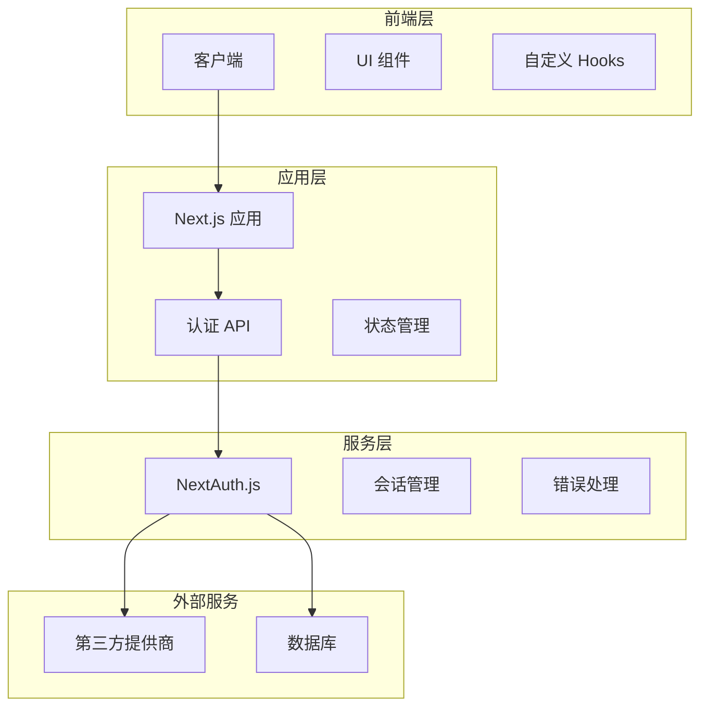
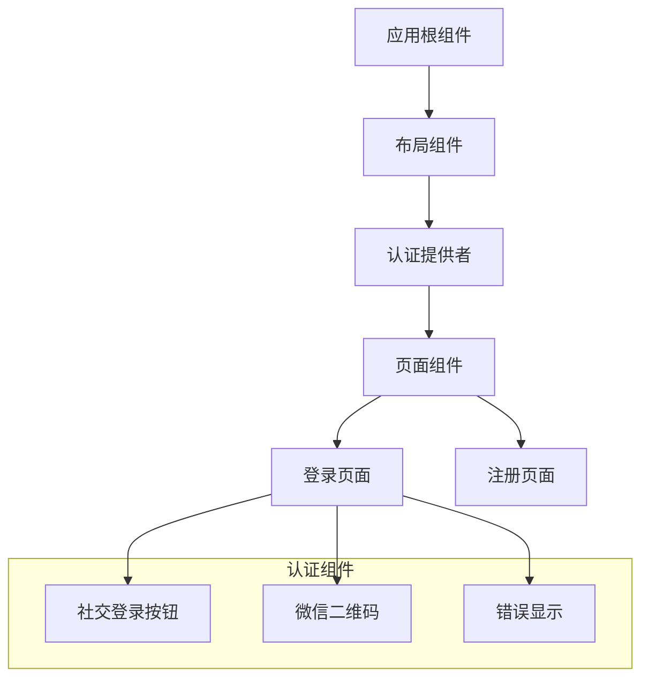
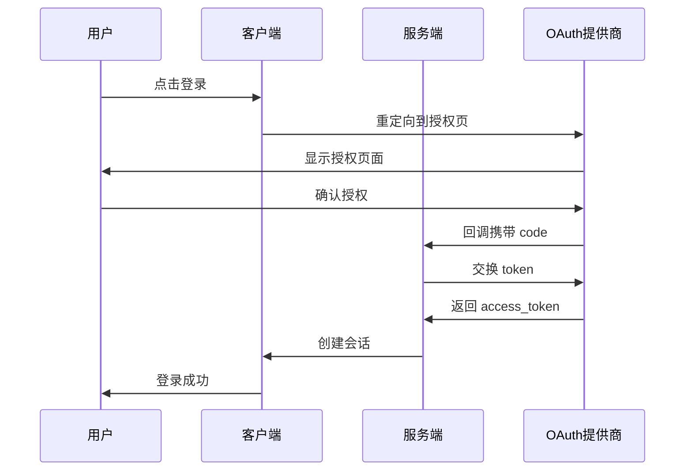
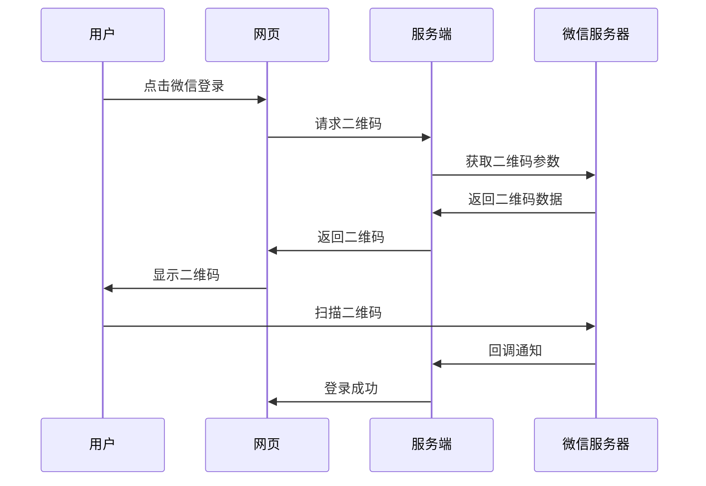
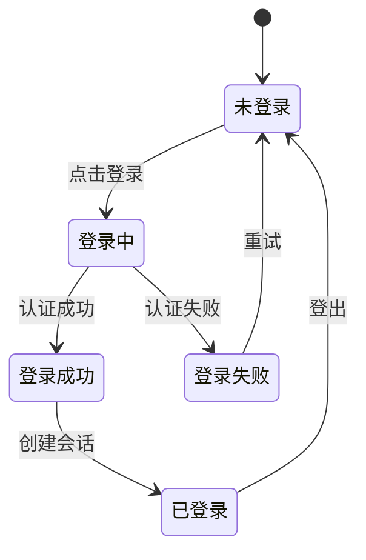
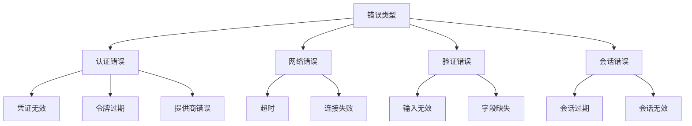
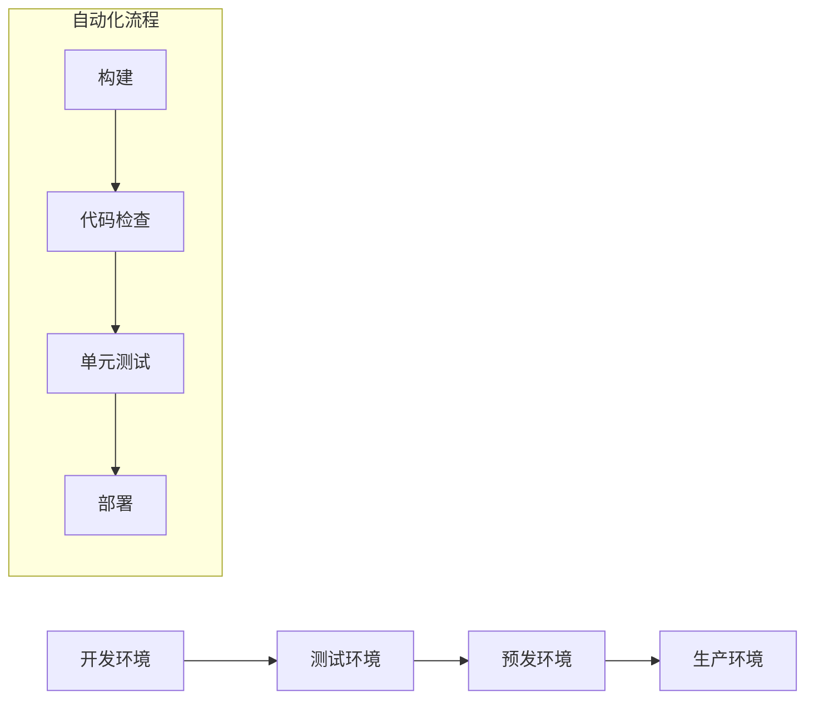

# 技术架构设计

## 1. 系统架构

### 1.1 整体架构



### 1.2 技术栈详情

#### 前端技术

- Next.js 14
- React 18
- TypeScript 5
- Tailwind CSS
- NextAuth.js

#### 后端服务

- Next.js API Routes
- NextAuth.js
- OAuth 2.0
- JWT

#### 数据存储

- Session Storage
- Local Storage
- HTTP Only Cookies

## 2. 组件架构

### 2.1 组件层次



### 2.2 组件职责

#### 认证提供者

```typescript
// AuthProvider.tsx
export function AuthProvider({ children }: { children: React.ReactNode }) {
  return <SessionProvider>{children}</SessionProvider>;
}
```

#### 社交登录按钮

```typescript
// SocialLoginButtons.tsx
interface SocialLoginButtonsProps {
  onSuccess?: () => void;
  onError?: (error: Error) => void;
}

export function SocialLoginButtons(props: SocialLoginButtonsProps) {
  // 实现逻辑
}
```

## 3. 认证流程

### 3.1 标准 OAuth 流程



### 3.2 微信登录流程



## 4. 数据流设计

### 4.1 状态流转



### 4.2 数据模型

#### 用户会话

```typescript
interface UserSession {
  id: string;
  user: {
    id: string;
    name?: string;
    email?: string;
    image?: string;
    provider?: string;
  };
  expires: string;
  accessToken?: string;
  refreshToken?: string;
}
```

#### 认证状态

```typescript
interface AuthState {
  status: "loading" | "authenticated" | "unauthenticated";
  session: UserSession | null;
  error?: Error;
}
```

## 5. 安全架构

### 5.1 认证安全

#### JWT 配置

```typescript
const jwtOptions = {
  secret: process.env.JWT_SECRET,
  maxAge: 30 * 24 * 60 * 60, // 30 days
  encryption: true,
};
```

#### Cookie 设置

```typescript
const cookieOptions = {
  httpOnly: true,
  secure: process.env.NODE_ENV === "production",
  sameSite: "lax" as const,
  path: "/",
};
```

### 5.2 请求安全

#### CORS 配置

```typescript
const corsOptions = {
  origin: process.env.NEXTAUTH_URL,
  credentials: true,
  methods: ["GET", "POST"],
};
```

## 6. 错误处理

### 6.1 错误分类



### 6.2 错误处理策略

#### 全局错误处理

```typescript
const errorHandler = {
  onError: (error: Error) => {
    console.error(error);
    // 错误上报
  },
  onSuccess: () => {
    // 清理错误状态
  },
};
```

## 7. 性能优化

### 7.1 代码优化

#### 动态导入

```typescript
const WeChatQRCode = dynamic(() => import("./WeChatQRCode"), {
  loading: () => <LoadingSpinner />,
  ssr: false,
});
```

#### 状态缓存

```typescript
const useAuthState = () => {
  const { data: session } = useSession();
  return useMemo(
    () => ({
      isAuthenticated: !!session,
      user: session?.user,
    }),
    [session]
  );
};
```

### 7.2 请求优化

#### 请求去重

```typescript
const useAuthRequest = () => {
  const [loading, setLoading] = useState(false);
  const pendingRequest = useRef<Promise<any> | null>(null);

  const request = async () => {
    if (pendingRequest.current) {
      return pendingRequest.current;
    }
    // 实现请求逻辑
  };
};
```

## 8. 监控设计

### 8.1 性能监控

#### 指标收集

```typescript
const metrics = {
  loginDuration: 0,
  successRate: 0,
  errorCount: 0,
};

const collectMetrics = () => {
  // 实现指标收集逻辑
};
```

### 8.2 错误监控

#### 错误上报

```typescript
const reportError = (error: Error) => {
  // 实现错误上报逻辑
};
```

## 9. 部署架构

### 9.1 环境配置

#### 开发环境

```env
NODE_ENV=development
NEXTAUTH_URL=http://localhost:3000
DEBUG=true
```

#### 生产环境

```env
NODE_ENV=production
NEXTAUTH_URL=https://your-domain.com
DEBUG=false
```

### 9.2 部署流程


