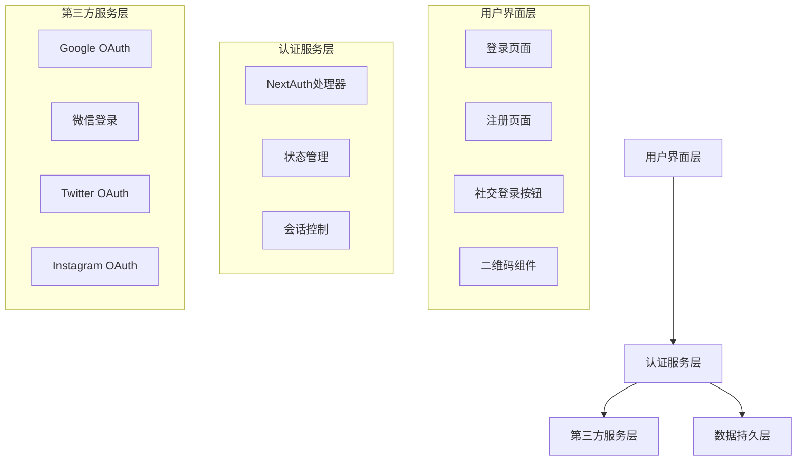

# 系统概述

## 1. 项目背景

Corks 是一个致力于提供优质葡萄酒社交体验的平台。认证系统是平台的基础设施之一，旨在为用户提供安全、便捷的身份验证服务。通过集成多种第三方登录方式，我们降低了用户的注册门槛，提升了用户体验。

## 2. 系统目标

### 2.1 业务目标

- 提供无缝的用户认证体验
- 支持多种登录方式满足不同用户群体
- 确保用户数据安全
- 提高用户注册转化率
- 降低用户登录摩擦

### 2.2 技术目标

- 构建可扩展的认证架构
- 实现高性能的身份验证
- 保证系统安全性
- 支持未来功能扩展
- 提供可靠的监控机制

## 3. 用户群体

### 3.1 目标用户

- 葡萄酒爱好者
- 社交媒体活跃用户
- 专业酒品从业者
- 休闲饮酒用户

### 3.2 用户特征

- 年龄段：25-45 岁
- 社交媒体使用频繁
- 对品质生活有追求
- 有分享意愿

## 4. 系统架构

### 4.1 技术栈

- **前端框架**: Next.js 14
- **认证框架**: NextAuth.js
- **UI 框架**: Tailwind CSS
- **状态管理**: React Hooks
- **类型系统**: TypeScript

### 4.2 核心组件

## 5. 功能概述

### 5.1 核心功能

- 多平台 OAuth 认证
- 微信扫码登录
- 会话管理
- 用户状态同步
- 错误处理机制

### 5.2 扩展功能

- 记住登录状态
- 多设备登录控制
- 登录日志记录
- 异常行为检测
- 账号安全预警

## 6. 安全考虑

### 6.1 安全机制

- CSRF 防护
- XSS 防护
- 请求加密
- 会话保护
- 权限控制

### 6.2 数据保护

- 用户信息加密
- 令牌安全存储
- 敏感数据脱敏
- 数据访问控制

## 7. 性能指标

### 7.1 响应时间

- 页面加载时间 < 2s
- 登录响应时间 < 1s
- 二维码生成时间 < 0.5s

### 7.2 并发处理

- 支持同时在线用户：10,000+
- 每秒登录请求：100+
- 系统可用性：99.9%

## 8. 合规性

### 8.1 法规遵从

- GDPR 合规
- CCPA 合规
- 网络安全法合规
- 数据保护条例遵从

### 8.2 隐私保护

- 用户授权机制
- 数据使用透明
- 隐私政策更新
- 用户选择权

## 9. 监控与维护

### 9.1 系统监控

- 性能监控
- 错误追踪
- 用户行为分析
- 安全事件监控

### 9.2 运维支持

- 日志管理
- 备份恢复
- 版本控制
- 部署自动化

## 10. 未来规划

### 10.1 短期计划

- 优化登录流程
- 增加生物识别支持
- 提升安全性能
- 改进用户体验

### 10.2 长期规划

- 支持更多认证方式
- 引入 AI 安全检测
- 建立风险控制体系
- 实现全球化部署
